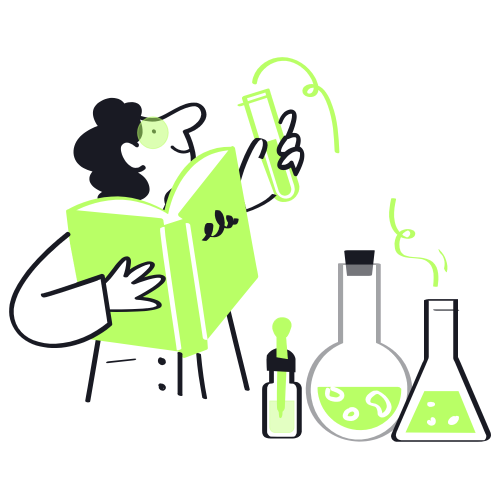

## Event: The Creative Code Jam

To promote a spirit of play and discovery, we host an annual Creative Code Jam. This event is a hackathon-style gathering where participants form teams to create something original within 24 hours. There are no set themes or boundaries, and participants are encouraged to use any medium or technology they choose—from visuals to soundscapes, generative art, or interactive web experiences. The focus is on free-form creativity rather than perfection, and we celebrate projects based on originality and the process of exploration itself.

We also bring in artists and coders who have pioneered experimental works to present short talks. They share the process behind their most innovative projects, inspiring participants to think outside the box and experiment without fear of failure.
