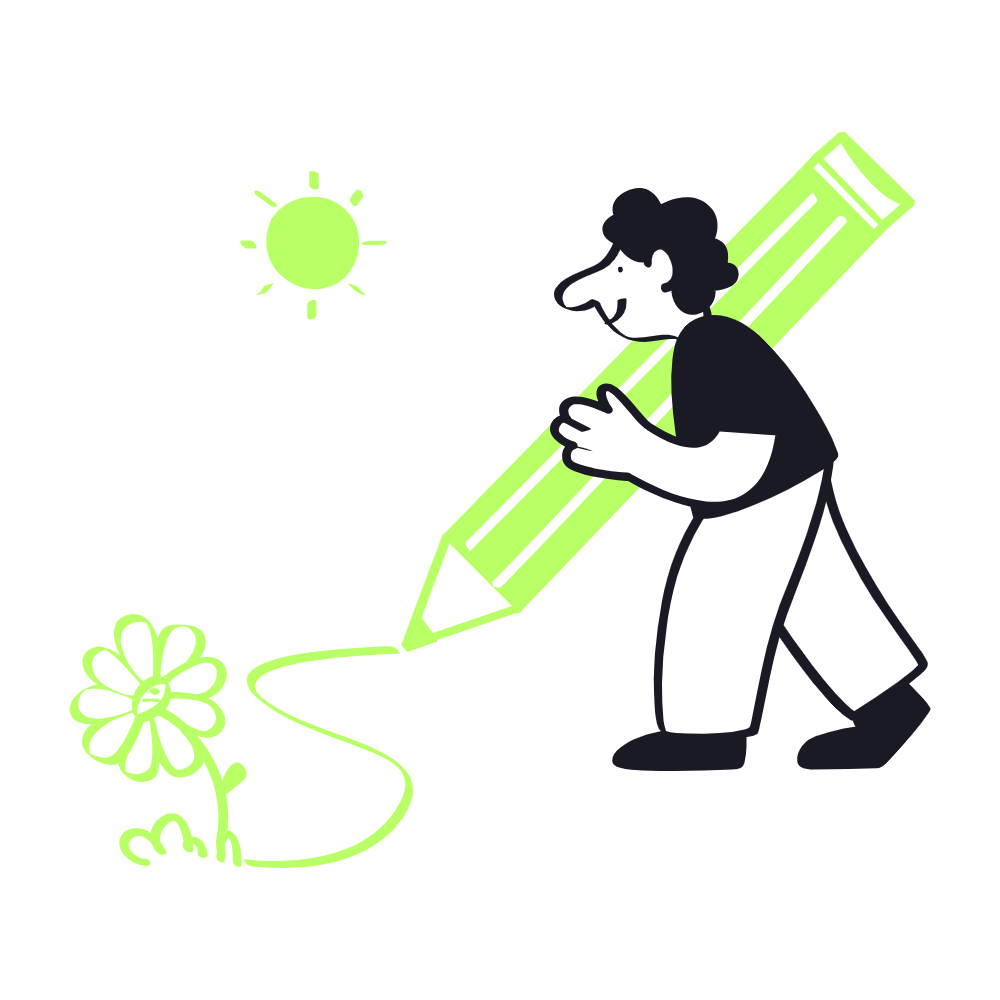

## Event: Digital Art Showcase and Talk Series

To celebrate the intersection of art and technology, we organize the Digital Art Showcase and Talk Series, an exhibition and panel discussion featuring artists who use code as their primary medium. The event includes an art gallery set up to display interactive installations, generative visuals, and digital sculptures—all powered by creative coding techniques.

The panel discussion features talks from artists who explain the creative and technical choices behind their works. Topics include algorithmic art, augmented reality installations, and creative uses of data visualization. This fusion event not only gives members a chance to exhibit their art but also educates the wider community about the artistic potential of coding.
