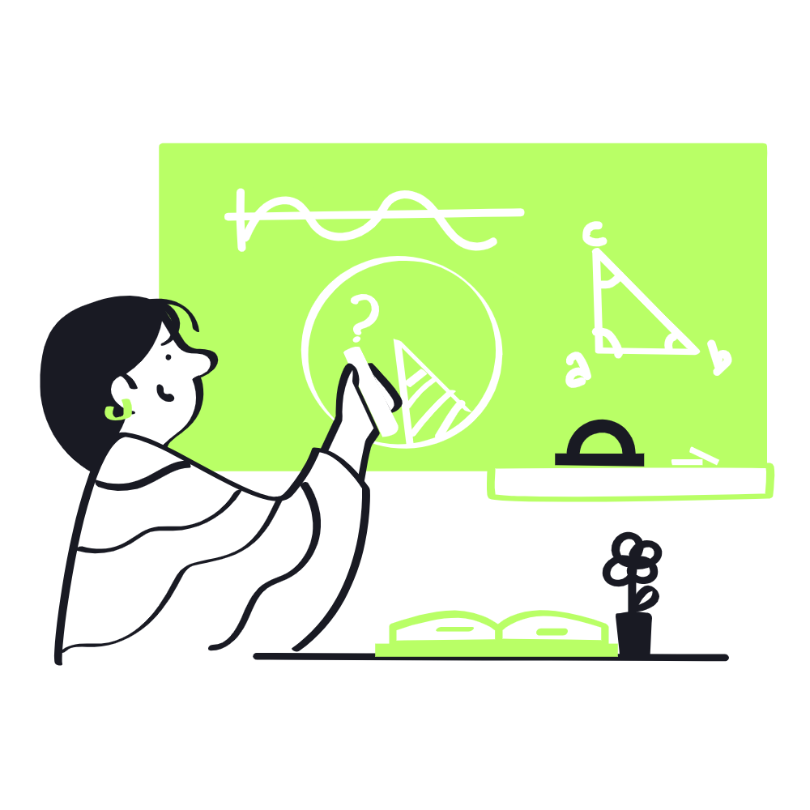

## Workshop Series: From Code to Canvas

To support skill-building, we host a structured From Code to Canvas workshop series, designed to take participants from basic coding skills to advanced creative techniques. Each session is hands-on, focusing on specific tools and methods like Processing, p5.js, or Three.js, and builds on the previous session's concepts.

Led by experienced creative coders, the workshops emphasize both technical skill development and artistic expression, with exercises that encourage participants to apply what they’ve learned in real-world projects. We also offer mentorship pairings, where more experienced members guide newcomers, providing tailored feedback and guidance on projects. This emphasis on learning cultivates a supportive community for both beginners and experienced coders to deepen their abilities and gain new perspectives.
